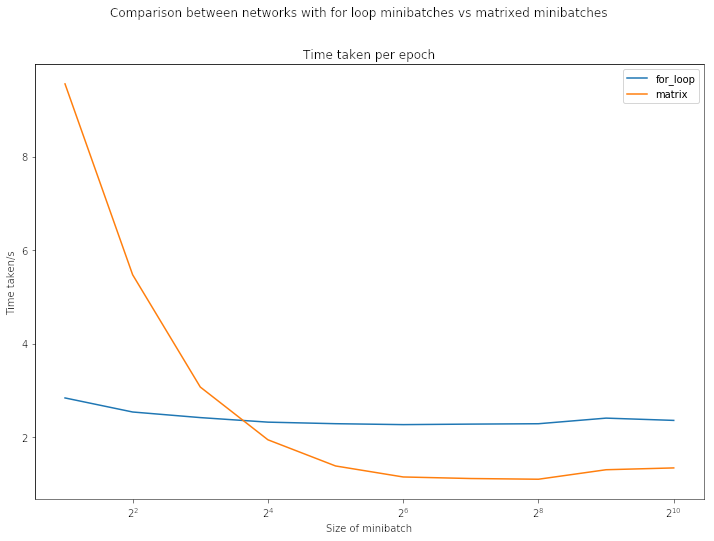
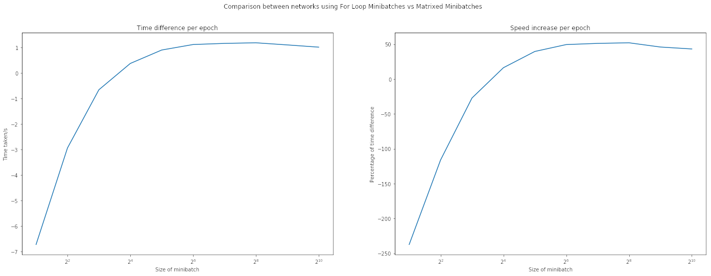
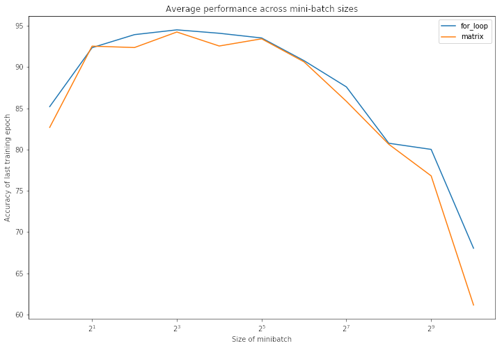

# Investigation of the performance gain from the use of matrixes in mini-batch stochastic gradient optimization

## Overview
This investigation aims to determine the performance of a matrix-based approach to mini-batch stochastic gradient descent (SGD) in comparison to a for-loop-based approach to mini-batch SGD, in terms of its training speed and time, over a range of mini-batch sizes. 

## Methodology
A simple neural network `network.py` is created to classify images of handwritten digits from the [MNIST Handwritten Digits Dataset](http://yann.lecun.com/exdb/mnist/), with reference to Michael Nielson, "Neural Networks and Deep Learning", Determination Press, 2015 [1]. The neural network uses basic libraries, mainly numpy, to implement a neural network with a single hidden layer of 30 neurons (can be modified) and mean-squared loss. This neural network uses for-loops for every example in a mini-batch.

The neural network is then modified `network_matx.py` to create a matrix for all examples in a mini-batch. Using matrix multiplication, the feedforward and backward pass operations are done simultaneously for all examples in a mini-batch. 

The average time taken per epoch is measured for different mini-batch sizes. Hypothetically, as the mini-batch size increases, the time taken per epoch for the matrix-based SGD should decrease, and the performance of matrix-based SGD should increase relative to for-loop-based SGD. The results are shown [below](#results).

## How to run locally
The following steps assume that you are running python in a conda environment. 
1. Clone the repository locally.
2. Create a new conda environment by importing `nndl.yml`.
3. Run `shell.ipynb` in jupyter notebook (or whatever floats your boat) using the nndl environment. 

## Results

Figure 1 shows the graph of time taken per epoch against the size of minibatch. The time taken per epoch using for-loop-based SGD remains relatively constant while the time taken per epoch using matrix-based SGD decreases. This is expected because the greater the size of the minibatch, the greater the size of each matrix. Thus, the total number of operations in matrix-based SGD would decrease, while thenumber of operations in for-loop-based SGD stays constant.

However, the time taken per epoch bottoms out when the size of minibatch is roughly 2^6 - 2^8. This is a good time to examine the graphs time difference and speed increase against the size of minibatch, as shown in Figure 2.

Notice that the largest speed increase is from 2^6 to 2^8, maxing out at 52.07% when Size of minibatch = 2^8. The speed increase, drops of after 2^8, but still remains positive. 

## Discussion
Does this mean we should use mini-batches with a size of 2^8 = 256 to maximise the speed increase from matrixes? Not necessarily.

So far, we have only considered the speed of each epoch. We have completely neglected the training performance of the neural networks, aka, the accuracy of image classification. Examine Figure 3 below.

When we plot the graph of average accuracy of the last training epochs against each minibatch size, we notice that the accuracy peaks around 2^1 - 2^5, ranging around  92% - 94% accuracy and maxing out at 2^3  at 94.50% for for-loop-based SGD and 94.24% for matrix-based SGD.   

Therefore, in order to benefit from the speed gains of matrixed minibatches and still achieve good training accuracy within a limited number of epochs, it makes sense to use a minibatch with a size in between the two ranges 2^6 - 2^8 and 2^1 - 2^5. Hence, a reasonable conclusion based on the above results would be to use a minibatch of size 2^5=32 or 2^6=64.

This result concurs with literature by Bengio [2](https://arxiv.org/abs/1206.5533) and more recently, Masters and Luschi [3](https://arxiv.org/abs/1804.07612) on the recommended size of minibatch used in training of neural networks, both of which recommend a minibatch of size 32.

## Further work
This investigation only considers a simple neural network architecture with only 1 hidden layer. The loss function used is the Mean Squared Error loss, which is not commonly used in modern neural networks in favour of Cross Entropy Loss due to the training slow down experienced when using MSE. Different loss functions and more complex architectures such as Convolutional Neural Networks can be experimented with.

The evaluation on the training accuracy done at the [Discussion](#discussion) is only an offhand remark rather than an in-depth look into the relationship between size of minibatch and accuracy achieved. The validation accuracy can be considered to circumvent overfitting. Different metrics can be considered in evaluating the performance of the different minibatch sizes. 

## Conclusion
This investigation has compared the performance of the a for-loop-based SGD and matrixed-based SGD, in terms of its training speed and time. Minibatch sizes between 64 and 256 see the greatest increase in training speed and reduction in training time. 

This investigation does not attempt to recommend a minibatch size as there are not enough factors considered adequately, such as training accuracy and the wide range of different loss and optimization functions that can be used today. Instead, this investigation is done more so in appreciation of the advances made in the never-ending quest to optimize our neural networks and make them more efficient. In addition, the simplicity of the neural networks used is a tribute to the fundamental mathematics and operations that go behind the high-level ML frameworks we see today. I would like to sincerely thank Michael Nielson for his clear and concise instruction into neural networks. Without which, I will not have deepened my understanding of neural networks to what I understand today (21/09/2022).

## References
[1] Nielson, M. (2015). Neural Networks and Deep Learning, Determination Press. Retrieved September 21, 2022, from http://neuralnetworksanddeeplearning.com/ 

[2] Bengio, Y. (2012, September 16). Practical recommendations for gradient-based training of Deep Architectures. arXiv.org. Retrieved September 21, 2022, from https://arxiv.org/abs/1206.5533 

[3] Masters, D., &amp; Luschi, C. (2018, April 20). Revisiting small batch training for Deep Neural Networks. arXiv.org. Retrieved September 21, 2022, from https://arxiv.org/abs/1804.07612 
